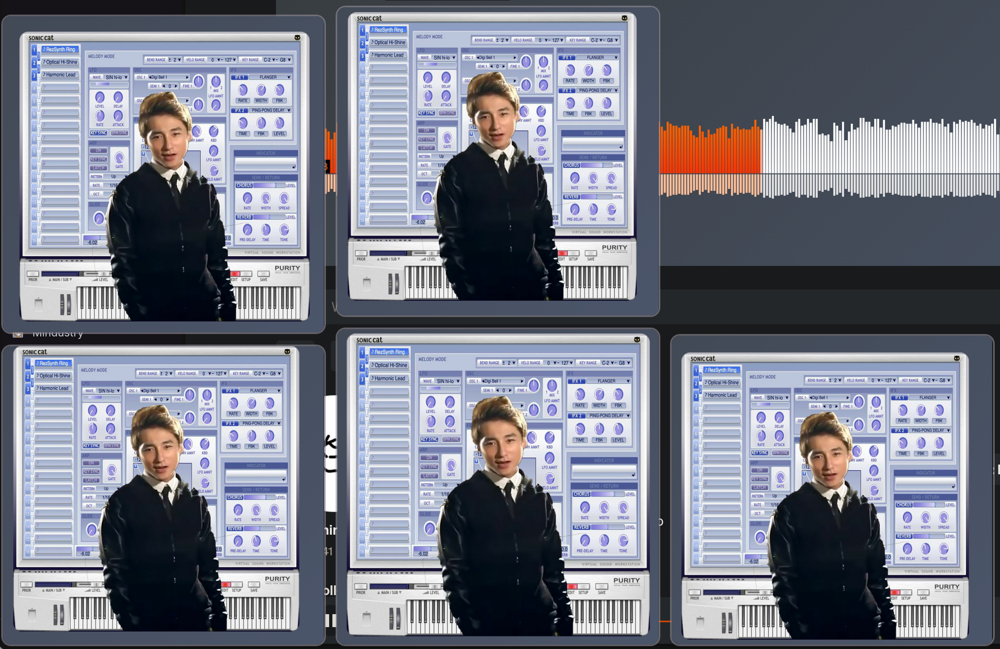
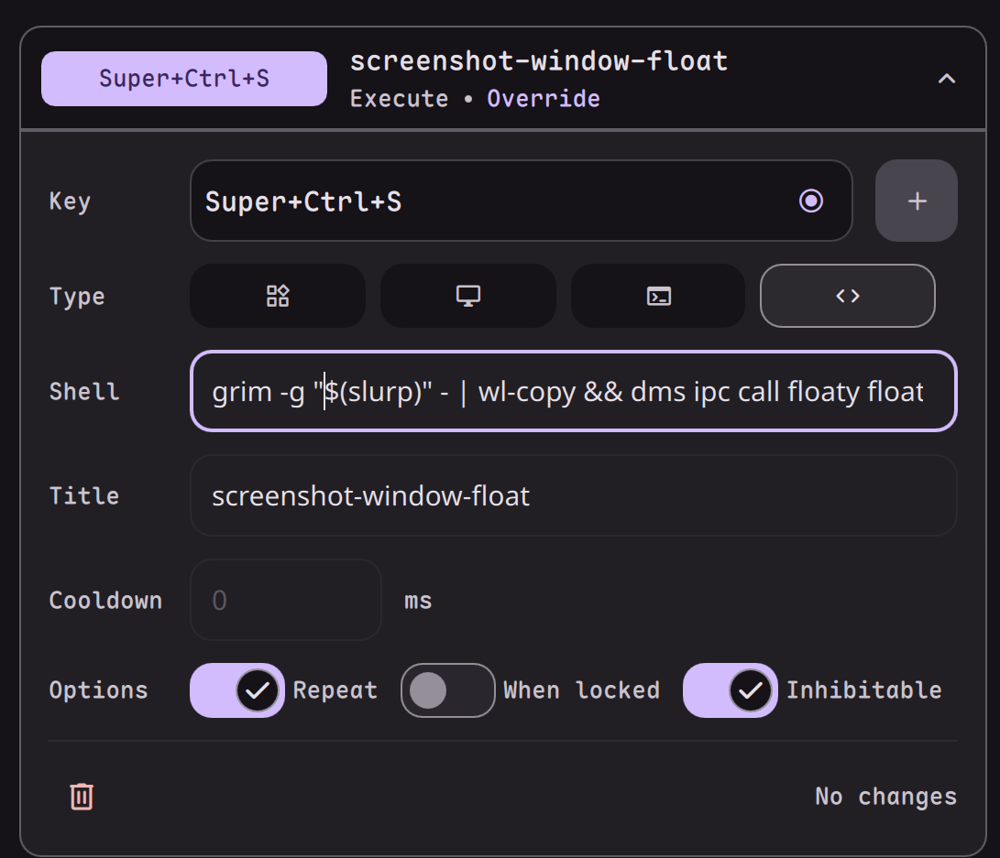

# Floaty for DMS

A powerful, feature-rich reference image utility for DankMaterialShell. Floaty lets you pin images, screenshots, and vector graphics on top of your workspace with intelligent layout, automatic scaling, and advanced IPC controls.



## Features

### Core Workflow

- **Float from Clipboard**: Instantly pin images from your clipboard.
- **Select File**: Import and pin image files from your local folders.
- **Drag & Drop Support**: Drag images from your browser or file manager directly onto the bar icon or popout menu to instantly pin them.
- **Smart Bar Icon**: The pill icon changes to your accent color when images are active, providing visual feedback.

### Display & Layout

- **Always on Top**: Images stay visible while you work, perfect for reference material.
- **Intelligent Auto-Tiling**: Newly spawned windows automatically stack vertically without overlapping, respecting screen boundaries and user-defined padding.
- **Smart Auto-Minimize**: Automatically shrinks to an icon when idle to save screen space, expanding back when hovered.
- **Dynamic Resizing**: Scale images using your mouse wheel or pinch gestures.
- **Drag & Move**: Reposition images anywhere on your screen.

### Format Support

- **Multi-Format Native Support**: Handles **PNG**, **JPG/JPEG**, **WebP**, **BMP**, and **SVG** (Vector Graphics) natively.
- **PDF Page Selection**: Choose specific pages from multi-page PDFs to use as references (converts selected page to a high-quality temporary PNG).

## Controls

- **Left Click + Drag**: Move the floating image.
- **Scroll Wheel / Pinch Gesture**: Resize (Zoom) the image.
- **Right Click**: Toggle minimized state (manual shrink/expand).
- **Middle Click**: Close the image window.
- **Right Click Bar Icon**: Instant paste from clipboard or last URL.
- **Left Click Bar Icon**: Open control menu (Popout).
- **Drag onto Bar Icon**: Drop image/URL to float immediately.
- **Drag onto Popout**: Drop image/URL anywhere on the popout menu to float.

## IPC Commands

Floaty exposes commands that you can bind to keyboard shortcuts or use in scripts:

```bash
# Float current clipboard image
hype ipc call floaty floatFromClipboard

# Open file selector to float
hype ipc call floaty selectFileAndFloat

# Close all active floating windows
hype ipc call floaty closeAllWindows

# Toggle minimize/expand for all windows
hype ipc call floaty toggleMinimizeAll

# Explicitly minimize all windows
hype ipc call floaty minimizeAll

# Explicitly expand all windows
hype ipc call floaty expandAll

# Float image from a specific URL or Path
hype ipc call floaty floatFromUrl "file:///path/to/image.png"
```

### Example: Screenshot to Floaty

Use DMS built-in screenshot command for a seamless workflow.

#### Option 1: Window Manager Binding (e.g., Niri)

Add this to your `config.kdl`:

```kdl
bindings {
    Print { 
        spawn "sh" "-c" "hype screenshot region --no-file --no-notify && hype ipc call floaty floatFromClipboard"; 
    }
}
```

#### Option 2: DMS Action Binding

You can also bind the command directly in DMS Settings:



Command to use:

```bash
hype screenshot region --no-file --no-notify && hype ipc call floaty floatFromClipboard
```

Or for full screen:

```bash
hype screenshot full --no-file --no-notify && hype ipc call floaty floatFromClipboard
```

## Notes

> [!WARNING]
> **Touchpad Scaling**: Touchpad gestures (pinch and scroll) might vary in sensitivity across different Wayland compositors. Using a mouse scroll wheel provides the most consistent precision.

## Requirements

- DMS clipboard support (built-in with DMS)
- `poppler-utils` (specifically `pdftocairo` and `pdfinfo`) for PDF support.

## Installation

1. Clone this repository into `~/.config/DankMaterialShell/plugins/`:

   ```bash
   git clone https://github.com/hthienloc/dms-floaty floaty
   ```

2. Reload DMS or use the IPC command:

   ```bash
   hype ipc plugins reload floaty
   ```

## Credits

- Inspired by [Kasasa](https://flathub.org/en/apps/io.github.kelvinnovais.Kasasa).
